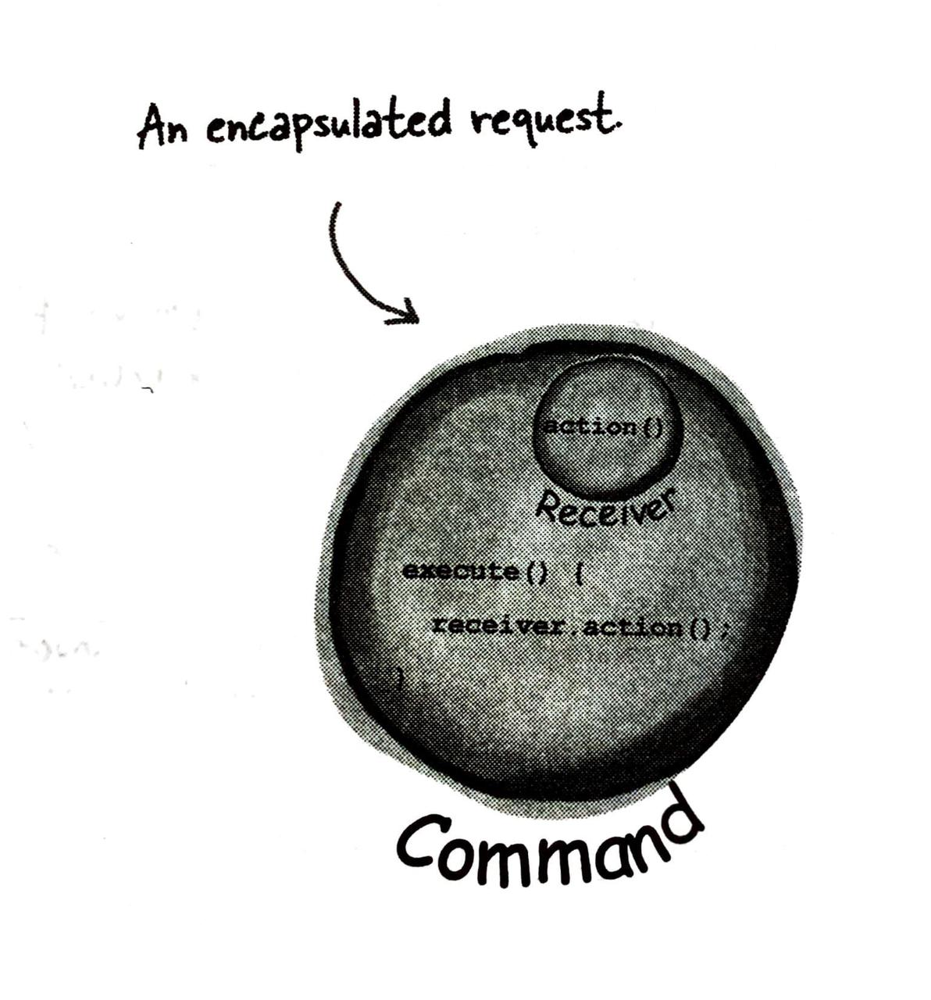
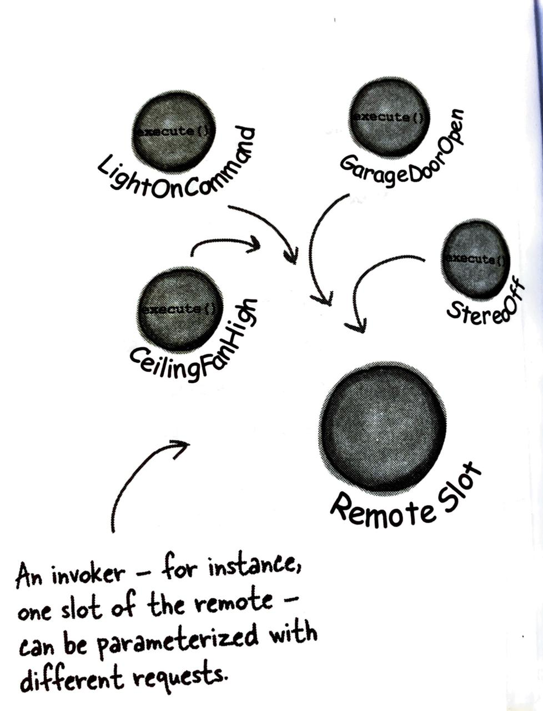
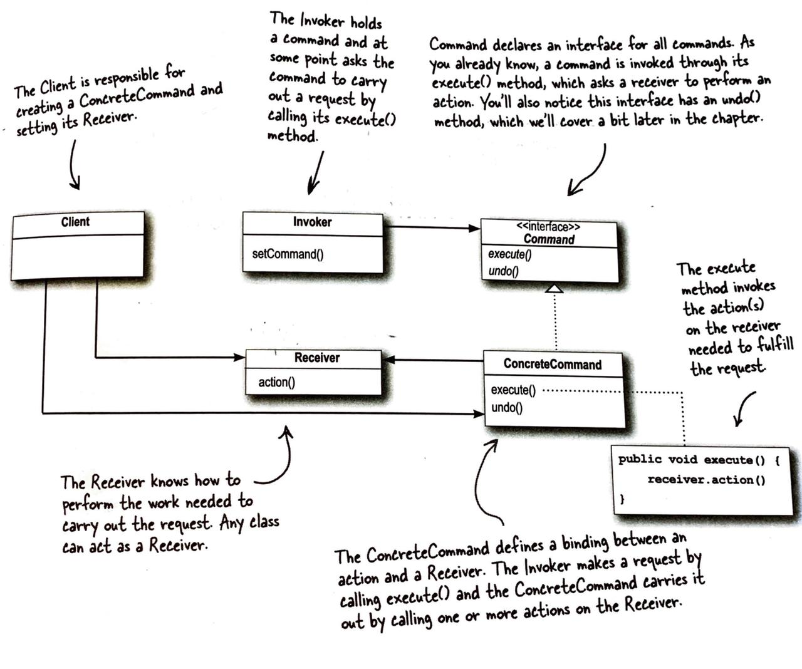
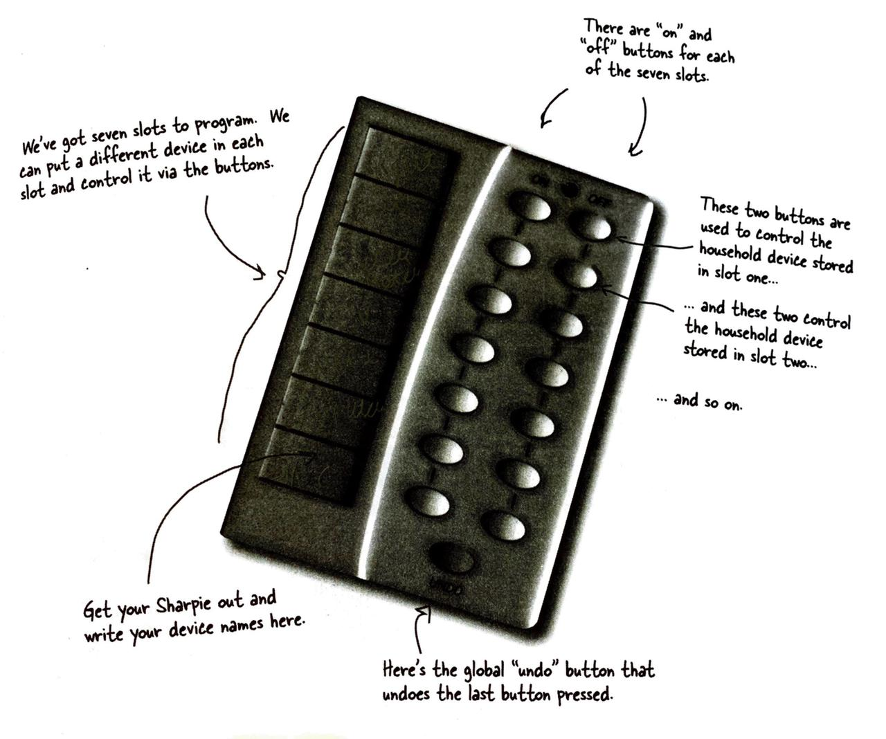

# Command-Pattern
The Command Pattern encapsulates a request as an object, thereby letting you parameterize other objects with different 
requests, queue or log requests, and support undoable operations

# The Command Object


# Examples of Commands Created by using Command Object


# Class Diagram



# Problem Statement
So lets jump onto our problem statement, We need to design a remote which can operate on Seven devices simultaneously 
and it has 2 buttons reserved for each device. And also it has a undo button which provide us functionality to undo 
the last active performed by the Remote.

Lets Check out our Remote Control....


Lets begin by making a Remote control with have only one button and it can turn on a Light when button is pressed.

1. Define a simple Remote control with have only one slot which can be configured as switch to perform a single
   operation on a single device.

    ```
    public class SimpleRemoteControl{
        Command slot;
        public SimpleRemoteControl() {}
    
        public void setCommand(Command command){
            slot = command;
        }
        public void buttonWasPressed(){
            slot.execute();
        }
    }
    ```
    
    # Method Usage
    - setCommand() method is used to assign a command to the Slot on Remote Control
    - buttonWasPressed() method is used to call execute function of the Command stored on the slot.

2. Define the device which is to be operated by Remote Control.
    ```
    public class Light{
        public void on(){
            System.out.println("Light is on");
        }
    }
    ```
    
    # Method Usage
    - on() method is used to turn on the light
    
3. Define a interface for Command. So that Remote Control knows what type commands can be assigned to its Slots.
    ```
    public interface Command{
        public void execute();
    }
    ```
   
4. Define Command which implements the Common Command interface.
    ```
   public class LightOnCommand implements Command{
     Light light;
     public LightOnCommand(Light light){
        this.light = light;
     }
     public void execute(){
        light.on();
     }
   }
    ```
   # Method Usage
   - execute() method in a command to stores how the particular task is executed on the device. For example: how to 
   turn on light in this case.  

5. Now we have to assign tasks to the Remote Control slots and use it to perform our desired tasks. 
    ```
   public class RemoteControlTest{
        public static void main(String[] args){
            //  Create a object of SimpleRemoteControl
            SimpleRemoteControl remote = new SimpleRemoteControl();
            //  Create a light object which is to turned on
            Light light = new Light();
            //  Command to turn on the light
            LightOnCommand lightOn = new LightOnCommand(light);
            //  Set the command to the remote
            remote.setCommand(lightOn);
            //  Now when the remote button is pressed the Light gets on
            remote.buttonWasPressed();
        }
    }
    ```  
   
   Here we have created a lightOn command which turns on a Light. Then we have configured our Remote Control slot to 
   store lightOn Command. When we press the button present on the Remote Control then, our remote Control asks lightOn 
   command to complete its task. The lightOn Command knows what its task is and so it completes its task.
   
   
### Here Remote Control do not know how to turn On light. It only knows which Command he has to call when a particular button is pressed. So Remote is decoupled with the task which are to be performed. We can assign multiple Commands to the same button(One at a time) and perform muliple tasks by using the same button.

#### Note: This code is present in [simple_remote_control!](https://github.com/chiragkaushik/Command-Pattern/tree/main/Simple_remote_control) directory in this repository 


 


